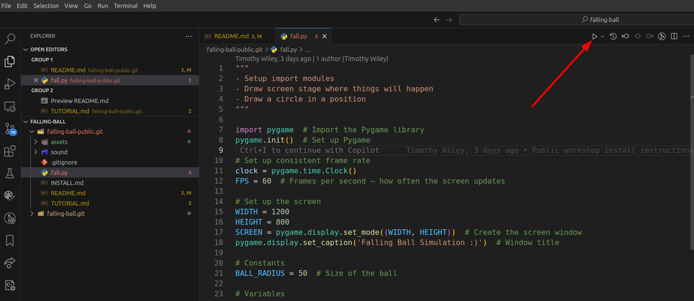
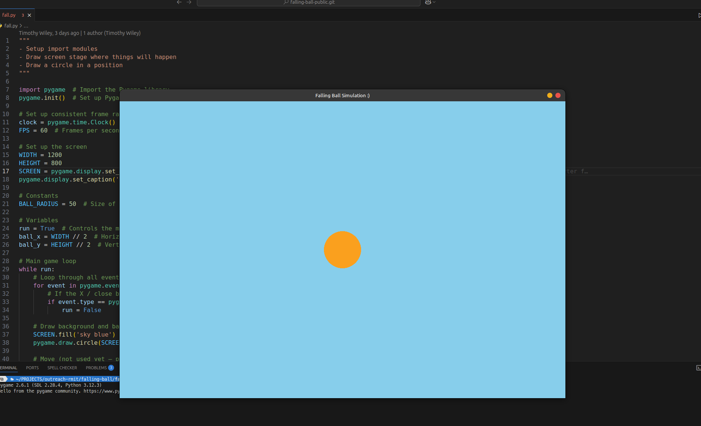

# RMIT SCT Falling Ball Workshop

This is the public repository for The School of Computing Technologies workshop on introduction to Algorithmic Thinking and Coding.

This workshop teaches you how to code a simulator in Python that models how objects fall due to gravity.
You'll learn the basics of physics behind free fall (including position, velocity, and acceleration) and how to translate those concepts into code. The workshop will focus on simulating a ball falling and rebounding off the ground, taking into account gravity and energy loss with each bounce. By the end, you’ll have built a simple yet powerful simulation that brings these physical principles to life using Python! 🏀 ⚽

This workshop is based on the Scratch project [Falling Ball](https://scratch.mit.edu/projects/1106875189/).

This repository steps students through the project in a 1-day tutorial, beginning with starter code in [fall.py](fall.py).

- [RMIT SCT Falling Ball Workshop](#rmit-sct-falling-ball-workshop)
  - [Setup and Requirements](#setup-and-requirements)
  - [Tutorial](#tutorial)
    - [Step 0: Setup VSCode and the code](#step-0-setup-vscode-and-the-code)
    - [Step 1: Set up the screen and draw a ball](#step-1-set-up-the-screen-and-draw-a-ball)
      - [Drawing a ball in the screen](#drawing-a-ball-in-the-screen)
    - [Step 2: Move the ball higher up](#step-2-move-the-ball-higher-up)
  - [Contributors](#contributors)


## Setup and Requirements

This tutorial requires the following software:

- Python 3.10+
- [pygame](https://www.pygame.org/wiki/about) library
- [VSCode](https://code.visualstudio.com/) as the IDE

The linked [Installation](INSTALL.md) instructions install these requirements for Windows and Mac.

## Tutorial

In this tutorial, we will use code to control what appears on the screen. Coding is how we tell the computer what to do, using a programming language—in this case, Python. Python is widely used because it is easy to read (the code looks a bit like plain English!) and can be used in many areas. It is used by companies like Google, Netflix, Spotify, and NASA, and across fields like web development, data science, automation, scientific research, game design, and healthcare—for things like predictive analytics and image analysis. It works well for beginners and is powerful enough for complex projects. 👍

In this tutorial, we will simulate a **ball falling and bouncing off the ground** ⚽ 🔽 We will learn how to position the ball, adjust its motion when falling, and even include gravity and make it lose energy with each bounce. As you go, you will learn how to use basic programming ideas like sequential steps, variables, functions, loops, and if-statements. These are building blocks that can be used to make a wide range of exciting projects.

We will write instructions using functions, which are named blocks of code that do something—like moving the ball or drawing on the screen. Functions can take variables as input, which are like labelled boxes that store information we want to use or change. Rather than writing everything from scratch, we can also use libraries—collections of functions written by others that we can bring into our own project. Pygame is one such library. It makes it easy to draw on the screen and build interactive projects like animations and simple games.

The tutorial is organised into **10 steps** 🦶. Each step adds a new idea and shows how we can use code to describe motion and animate the virtual ball.

The system uses Python and [pygame](http://www.pygame.org/wiki/about), a toolkit to write games. 🎮

We have already provided an initial code template in file [fall.py](fall.py). You need to copy-and-paste the contents of this file into your own VSCode folder.

### Step 0: Setup VSCode and the code

To get started with this tutorial, you will need to use VSCode, and get the starting Python code file. To get underway:

1. Open VSCode.
2. Create a new folder where you want your project to be, for example, folder `falling-ball`.
3. Download the file `fall.py` file to your project folder. This can be done by using the download button at the top right corner in the file in GitHub:

    

    - Alternatively, you create an empty file [`fall.py`](https://raw.githubusercontent.com/outreach-csit/falling-ball-public/refs/heads/main/fall.py?token=GHSAT0AAAAAAC5GJNQPCTNCQHAGILHIVDE2Z7SGBWA) with VSCode in your project and then do copy-and-paste; GitHub has s button to copy the file contents into memory:
4. Save the file.

All ready, it is time to run the code. You can do that by clinking the **PLAY** triangle button in the top-right corner of the VSCode window:



You should see the following window, with a ball (or it is a sun? 🌞) in the center of the stage:



### Step 1: Set up the screen and draw a ball

In the first step, we just want to **understand** the code we were given. Having a good understanding of each piece will be important to know how to modify it later on... 😉

In Pygame—and in most libraries designed for drawing or graphics—the screen is like a piece of graph paper. In fact, as you learnt in school, the window created is a **Cartesian plane**, as you learnt in school! As the window is a 2D plane, we refer to a particular point (or location) in it using the `x` and `y` coordinate system. A point is called a "pixel", and we can set each pixel to different colors.

- The top-left corner is `(0, 0)`.
- Moving to the right increases the `x` coordinate. Moving down increases `y`.
- So point `(100, 100)` means 100 pixels across and 100 pixels down.

Let us understand the skeleton code before modifying it. 👀

The first two lines tell Python to load and initialize the `pygame` library for building graphical applications and games, and the next two instructions create a clock that will be used to tell Pygame to re-draw the screen at 60 frames/seconds.

```python
import pygame  # Import the Pygame library
pygame.init()  # Set up Pygame

# Set up consistent frame rate
clock = pygame.time.Clock()
FPS = 60  # Frames per second – how often the screen updates
```

> [!NOTE]
> In the code, you'll see lines that start with a `#` symbol — these are **comments**. They're not run by the computer. Comments are used to explain what each part of the code does, which makes it easier to read later (by others and you in the future!). Always leave comments in your code.

Next, the following code defines the application screen. It will create a display screen of size `1200` (width) by `800` (length) and set its title too:

```python
# Set up the screen
WIDTH = 1200
HEIGHT = 800
SCREEN = pygame.display.set_mode((WIDTH, HEIGHT))  # Create the screen window
pygame.display.set_caption('Falling Ball Simulation :)')  # Window title
```

Here, `WIDTH` and `HEIGHT` are the **variables** storing the size of the window we want to create.

The variable `SCREEN` is the most important one here: it refers to the whole Pygame screen window and we will use it to draw things on it!

> **QUESTION*: Remember we said that point `(0, 0)` is the top-left one in the screen? Well, our right-bottom pixel will then be `(1199, 799)`. _What would the middle of the screen window be?_

Next, we define three **variables** that define the size of the ball we want to draw, and its initial location in the center of the screen:

```python
# Ball properties
ball_radius = 50  # size of the ball
ball_x = WIDTH // 2  # initial x position of the ball
ball_y = HEIGHT // 2  # initial y position of the ball
```

A **simulation** is implemented like a "[_flipbook_](https://en.wikipedia.org/wiki/Flip_book)", by drawing different pictures over and over, one after another, very very fast. Each picture will be a small step in the simulation, for example the ball moving just a tiny bit.

Concretely, a simulation is a continuous repetition of three phases:

1. Check if user has closed the screen (with the mouse). If so, terminate the simulation.
2. Do all the changes to the current state of the simulation, for example, move the ball location.
3. Re-draw the screen with the new state of the simulation.

This repetition is implemented by a `while` loop, that will execute a given piece of code until the simulation is not running anymore. To store whether the simulation is running, we make use a boolean variable `simulation_runnning`, which is initially `True` and made `False` when the user closes the window. This is how the simulation-cycle looks like:

```python
# Main game loop
simulation_runnning = True  # Controls the main loop
while simulation_runnning:
    ...
    # 1. if window is closed; set simulation_runnning = False
    ...
    # 2. do some changes to the SCREEN
    ...

    # 3. Update display and wait to keep frame rate
    pygame.display.update()
    clock.tick(FPS)  # Delay to keep frame rate steady
```

We have not shown the code for the first step, it is not that interesting. Basically, it will set  variable `simulation_runnning` to False, which will cuase the `while` look to terminate, and the whole program finishes: there is nothing left in th program to execute...

In the second step, which we will explain below, the simulation **does all the updates in the `SCREEN` for the cycle**, for example, changing the position of the ball, setting its (new) color, changing the background color or picture, etc.

The final step in each simulation cycle is to **re-draw and update the screen**, that is, to draw the "new picture" with the changes just done in step 2! ✏️

#### Drawing a ball in the screen

Let us look at the second step in the simulation cycle. The initial code does two things:

1. Paint the screen blue, to represent the background.
2. Draw a circle in the middle of the screen to represent the ball.

Both steps are changes to the simulation screen, which is always stored in variable `SCREEN` created at the very start as we explained above. So here is the code for those two instructions:

```python
SCREEN.fill("yellow")  # Fill the screen with a sky blue background
pygame.draw.circle(SCREEN, "blue", (ball_x, ball_y), ball_radius)  # Draw the ball
```

The first command "fills" the `SCREEN` with `yellow` color, while the second one draws a circle with the following information:

- `SCREEN` is where we want the circle to be drawn, namely, in the window of the simulation.
- `blue` is the colour we want the ball to be inside.
- `(ball_x, ball_y)` gives the position.
- `ball_radius` is the size of the ball.

In this case, `pygame` is the library, `draw` is the module inside it, and `circle` is the **function** that does the actual drawing. All is provided by the library we imported at the top!

If you're using VS Code, you can hover over the function name to see what inputs it takes. Or you can search online—typing something like “pygame draw circle” into your browser will often give you clear documentation and examples. You can also use the interactive Python shell to explore help functions if you're comfortable doing so.

### Step 2: Move the ball higher up

Time to do implement some of _our_ changes!

In this step, you are to:

1. Change the background of the simulation to whatever color you prefer. 🖌️ Most obvious colors will be accepted, but there are many more Pygame knows about [here](https://www.pygame.org/docs/ref/color_list.html).
2. Put the ball higher up in the screen. You can do that by changing the variable that holds the `y` coordinate of the ball. 😉 Put the ball up in the screen so that it has "space" to fall, but is all visible. _What number would you use?_Remember that `(0, 0)` is not the middle of the screen, but the top-left corner.

Go ahead and set the initial simulation step as you wish! 🖐️

## Contributors

- Prof. Sebastian Sardina (contact: sebastian.sardina@rmit.edu.au)
- Mr. Marcos Sardina (original Scratch project and first translation to Python)
- Dr. Timothy Wiley
- Dr. Irina Grossman
- Dr. Daniel Beck
