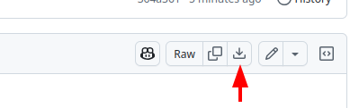

# RMIT SCT Falling Ball Workshop

This is the public repository for The School of Computing Technologies workshop on introduction to Algorithmic Thinking and Coding.

This workshop teaches you how to code a simulator in Python that models how objects fall due to gravity.
You'll learn the basics of physics behind free fall (including position, velocity, and acceleration) and how to translate those concepts into code. The workshop will focus on simulating a ball falling and rebounding off the ground, taking into account gravity and energy loss with each bounce. By the end, you’ll have built a simple yet powerful simulation that brings these physical principles to life using Python! 🏀 ⚽

This workshop is based on the Scratch project [Falling Ball](https://scratch.mit.edu/projects/1106875189/).

This repository steps students through the project in a 1-day tutorial, beginning with starter code in [fall.py](fall.py).

## Setup and Requirements

This tutorial requires the following software:

* Python 3.10+
* [pygame](https://www.pygame.org/wiki/about) library
* [VSCode](https://code.visualstudio.com/) as the IDE

The linked [Installation](INSTALL.md) instructions install these requirements for Windows and Mac.

## Tutorial

In this tutorial, we will use code to control what appears on the screen. Coding is how we tell the computer what to do, using a programming language—in this case, Python. Python is widely used because it is easy to read (the code looks a bit like plain English!) and can be used in many areas. It is used by companies like Google, Netflix, Spotify, and NASA, and across fields like web development, data science, automation, scientific research, game design, and healthcare—for things like predictive analytics and image analysis. It works well for beginners and is powerful enough for complex projects. 👍

In this tutorial, we will simulate a **ball falling and bouncing off the ground** ⚽ 🔽 We will learn how to position the ball, adjust its motion when falling, and even include gravity and make it lose energy with each bounce. As you go, you will learn how to use basic programming ideas like sequential steps, variables, functions, loops, and if-statements. These are building blocks that can be used to make a wide range of exciting projects.

We will write instructions using functions, which are named blocks of code that do something—like moving the ball or drawing on the screen. Functions can take variables as input, which are like labelled boxes that store information we want to use or change. Rather than writing everything from scratch, we can also use libraries—collections of functions written by others that we can bring into our own project. Pygame is one such library. It makes it easy to draw on the screen and build interactive projects like animations and simple games.

The tutorial is organised into **10 steps** 🦶. Each step adds a new idea and shows how we can use code to describe motion and animate the virtual ball.

The system uses Python and [pygame](http://www.pygame.org/wiki/about), a toolkit to write games. 🎮

We have already provided an initial code template in file [fall.py](fall.py). You need to copy-and-paste the contents of this file into your own VSCode folder.

### Step 0: Setup VSCode and the code

To get started with this tutorial, you will need to use VSCode, and get the starting Python code file. To get underway:

1. Open VSCode.
2. Create a new folder where you want your project to be, for example, folder `falling-ball`.
3. Download the file `fall.py` file to your project folder. This can be done by using the download button at the top right corner in the file in GitHub:

    

    * Alternatively, you create an empty file [`fall.py`](https://raw.githubusercontent.com/outreach-csit/falling-ball-public/refs/heads/main/fall.py?token=GHSAT0AAAAAAC5GJNQPCTNCQHAGILHIVDE2Z7SGBWA) with VSCode in your project and then do copy-and-paste; GitHub has s button to copy the file contents into memory:
4. Save the file.

All ready, it is time to run the code. You can do that by clinking the **PLAY** triangle button in the top-right corner of the VSCode window:

You should see the following window, with a ball (or it is a sun? 🌞) in the center of the stage:

## Contributors

* Prof. Sebastian Sardina (contact: sebastian.sardina@rmit.edu.au)
* Mr. Marcos Sardina (original Scratch project and first translation to Python)
* Dr. Timothy Wiley
* Dr. Irina Grossman
* Dr. Daniel Beck
